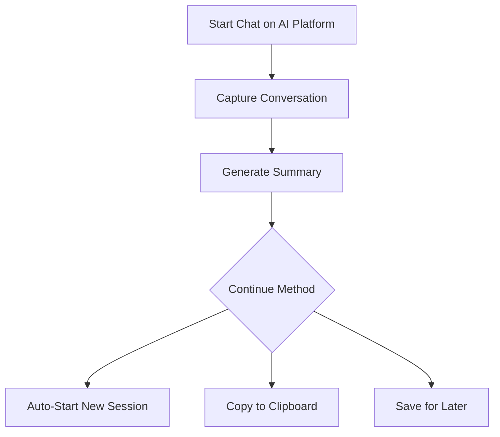
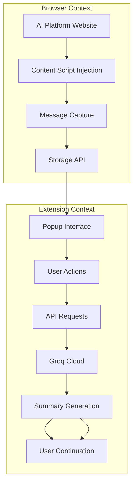

# AI Chat Continuation Assistant

<div align="center">


<h1>✨ AI Chat Continuation Assistant ✨</h1>

<p><strong>Seamlessly continue your AI conversations across sessions</strong></p>

[🌟 Features](#-features) • [🛠️ Installation](#️-installation) • [🚀 Usage](#-usage) • [📁 Project Structure](#-project-structure)

</div>

---

## 🎯 Overview

**Tired of starting from scratch in every AI chat session?** The AI Chat Continuation Assistant solves this problem by intelligently capturing, summarizing, and continuing your conversations across sessions. Whether you're studying, coding, or brainstorming, maintain your flow without repetition.

### 🔄 **The Problem**
- 📝 **Manual Context Transfer** – Repeating previous conversations
- ⏳ **Time Wasted** – Explaining progress each session
- 🔄 **Loss of Momentum** – Breaking your train of thought
- 🚫 **Inefficient Workflow** – Starting from zero repeatedly

### ✨ **Our Solution**
- 🤖 **AI-Powered Summaries** – Intelligent continuation context
- 🚀 **One-Click Continuation** – Resume conversations instantly
- 📊 **Visual Conversation Flow** – See your chat structure
- 💾 **Session Management** – Store and retrieve past chats

---

## 🌟 Features

### 🤖 **Core Capabilities**
- **Smart Chat Capture** – Automatically extracts conversations from major AI platforms
- **Intelligent Summarization** – Uses Llama 3.1-8b-instant to generate continuation-ready summaries
- **Cross-Session Continuity** – Pick up exactly where you left off
- **Multi-Platform Support** – Works with ChatGPT, Claude, Gemini, and more

### 🎨 **User Experience**
- **Clean Visual Interface** – Modern, intuitive popup design
- **Message Flow Visualization** – See conversation structure with length indicators
- **Real-Time Feedback** – Clear status updates and progress indicators
- **Responsive Design** – Works perfectly on all screen sizes

### ⚡ **Productivity Boosters**
- **Auto-Send Mode** – Automatically starts new sessions with your summary
- **Clipboard Integration** – One-click copy for manual pasting
- **History Management** – Store, view, and reuse past summaries
- **Model Selection** – Choose between different AI models for summarization

### 🛡️ **Reliability**
- **Error Handling** – Graceful recovery from API issues
- **Data Privacy** – All processing happens locally with secure API calls
- **Platform Compatibility** – Optimized selectors for each supported site
- **Offline Capability** – View and manage stored conversations offline

---

## 🌐 Supported Platforms

| Platform | Status | Features |
|----------|--------|----------|
| **ChatGPT** (chat.openai.com) | ✅ Fully Supported | Complete message capture, optimal formatting |
| **Claude** (claude.ai) | ✅ Fully Supported | Full conversation extraction |
| **Gemini** (gemini.google.com) | ✅ Fully Supported | Accurate message parsing |
| **Grok** (grok.com) | ✅ Fully Supported | Reliable chat capture |
| **Perplexity** (perplexity.ai) | ✅ Fully Supported | Conversation extraction |
| **DeepSeek** (deepseek.com) | ✅ Fully Supported | Message collection |

---

## 🛠️ Installation

### **Prerequisites**
- Google Chrome browser (Version 88+)
- Groq API key (free tier available)
- Basic understanding of Chrome extensions

### **Step-by-Step Installation**

1. **📥 Get the Code**
   ```bash
   git clone https://github.com/Samprit74/ai-summary-extention-v2.git
   cd ai-summary-extention-v2
   ```

2. **🌐 Load in Chrome**
   - Open Chrome and navigate to `chrome://extensions/`
   - Enable **Developer mode** (toggle in top right)
   - Click **"Load unpacked"**
   - Select the project folder you cloned

3. **🔑 Configure API Key**
   - Click the extension icon in your toolbar
   - Click the ⚙️ **Settings** button
   - Enter your Groq API key
   - Click **Save**
   - ✅ **Ready to use!**

### **Getting a Groq API Key**
1. Visit [console.groq.com](https://console.groq.com)
2. Sign up for a free account
3. Navigate to API Keys section
4. Create a new API key
5. Copy and paste into extension settings

---

## 🚀 Usage Guide

### **Basic Workflow**



### **Step 1: Capture a Conversation**
1. Open any supported AI platform (e.g., ChatGPT)
2. Have a meaningful conversation
3. Click the **extension icon** in Chrome toolbar
4. Click **"Capture Chat"**
5. Watch messages populate in real-time

### **Step 2: Generate Summary**
1. After capturing, click **"Generate Summary"**
2. Wait for AI processing (typically 5-10 seconds)
3. Review the generated continuation summary
4. The summary includes:
   - Context of previous discussion
   - User's understanding level
   - Natural continuation prompt

### **Step 3: Continue Your Chat**
Choose your continuation method:

#### **Option A: 🚀 Auto-Start (Recommended)**
- Clicks "Auto-Start" button
- Opens new chat session automatically
- Pastes summary and sends automatically
- Most seamless experience

#### **Option B: 📋 Manual Copy**
- Click "Copy Summary" button
- Open your AI platform manually
- Start new chat
- Paste summary and continue

#### **Option C: 💾 Save for Later**
- Summary automatically saves to history
- Access anytime from extension popup
- Useful for reference or multiple continuations

### **Advanced Features**

#### **View History**
- Click **"History"** button in popup
- Browse past summaries by date/platform
- Click any summary to load it
- Delete individual items or clear all

#### **Settings Customization**
- **Model Selection**: Choose different Llama models
- **API Configuration**: Update your Groq API key
- **Performance**: Adjust message limits and token counts
- **Platform Settings**: Fine-tune for specific AI sites

#### **Troubleshooting**
- **Chat not capturing?** Refresh the page and try again
- **API errors?** Verify your Groq API key in settings
- **Slow summarization?** Check your internet connection
- **Formatting issues?** Report platform-specific problems

---

## 📁 Project Structure

```
ai-summary-extension-v2/
│
├── 📄 manifest.json          # Extension configuration (Manifest V3)
├── 📄 popup.html            # Main extension interface
├── 📄 popup.js              # Frontend logic & API communication
├── 📄 content.js            # Injected into AI platforms
├── 📄 styles.css            # All styling & animations
├── 📄 README.md             # This documentation
│
├── 📁 assets/
     └── icon.png            # Extension icons (various sizes)
```

### **File Descriptions**

#### **manifest.json**
- Chrome extension configuration
- Permissions and content scripts
- Manifest V3 compatibility
- Icon and action definitions

#### **popup.html**
- Main user interface
- Responsive layout with Flexbox/Grid
- Interactive elements and controls
- Status display areas

#### **popup.js**
- Core extension logic
- Groq API communication
- Chrome storage management
- User interaction handling
- Error handling and feedback

#### **content.js**
- Injected into supported websites
- Message detection and extraction
- DOM manipulation and observation
- Platform-specific selectors

#### **styles.css**
- Modern CSS with CSS variables
- Responsive design patterns
- Smooth animations and transitions
- Dark/light mode considerations

---

## ⚙️ Configuration

### **Default Settings**

```javascript
const DEFAULT_CONFIG = {
  GROQ_API_KEY: "",                    // User-provided API key
  MODEL: "llama-3.1-8b-instant",       // Default AI model
  MAX_MESSAGES: 19,                    // Messages to store
  MAX_MESSAGE_LENGTH: 500,             // Characters per message
  SUMMARY_TOKENS: 2000,                // Token limit for summaries
  SUMMARY_TEMPERATURE: 0.3,            // Creativity level (0-1)
  AUTO_SEND_DELAY: 1000,               // Delay before auto-send (ms)
  ENABLE_NOTIFICATIONS: true,          // Show success/error messages
  SAVE_HISTORY: true,                  // Store summaries locally
};
```
---

## 🔧 How It Works

### **Architecture Overview**



### **Technical Process**

1. **Detection & Injection**
   - Content script injected on supported domains
   - MutationObserver monitors DOM changes
   - Messages detected via platform-specific selectors

2. **Message Processing**
   - Text extraction and cleaning
   - Metadata collection (timestamp, role, length)
   - Truncation to length limits
   - Formatting for API consumption

3. **AI Summarization**
   - Structured prompt sent to Llama model
   - Context preservation instruction
   - User understanding evaluation
   - Continuation-focused formatting

4. **User Delivery**
   - Multiple delivery options
   - Clipboard integration
   - Auto-navigation and form filling
   - History storage and management

### **Security & Privacy**

- **No Data Storage**: We don't store your conversations on our servers
- **Secure API Calls**: All requests use HTTPS encryption
- **Local Processing**: Message extraction happens in your browser
- **Transparent Operations**: Open source code for verification
- **User Control**: Full control over stored data and API usage

---

## 🐛 Troubleshooting

### **Common Issues & Solutions**

| Issue | Solution |
|-------|----------|
| **Extension not capturing messages** | Refresh the page, ensure you're on a supported platform |
| **API key errors** | Verify key in settings, ensure it's active on Groq |
| **Slow summarization** | Check internet speed, try reducing message count |
| **Messages cut off** | Increase MAX_MESSAGE_LENGTH in settings |
| **Auto-start not working** | Check popup permissions, disable ad blockers temporarily |
| **History not saving** | Verify Chrome storage isn't full, check SAVE_HISTORY setting |

### **Debug Mode**

Enable debug logging in the console:

```javascript
// In popup.js, set DEBUG to true
const DEBUG = true;
```

Check Chrome Developer Tools:
- Console for error messages
- Network tab for API requests
- Application tab for storage inspection

---
### **Development Setup**
```bash
# Clone repository
git clone https://github.com/Samprit74/ai-summary-extention-v2.git

# Navigate to project
cd ai-summary-extention-v2

# Load in Chrome (see Installation section)
```
---

## 🙏 Acknowledgments

- **Groq** for providing the Llama API infrastructure
- **Meta** for the Llama 3.1 model
- **OpenAI, Anthropic, Google** for their AI platforms
- **Chrome Extension developers** community
- **All beta testers and contributors**

---

## 📞 Support & Contact

- **GitHub Issues**: [Report bugs or request features](https://github.com/Samprit74/ai-summary-extention-v2/issues)
- **Email**: [sampritroy1o1@gmail.com]
- **Documentation**: This README and code comments

**Need help?**
1. Check the [Troubleshooting](#-troubleshooting) section
2. Search existing GitHub issues
3. Create a new issue with details of your problem

---

<div align="center">

## ✨ Start Seamless AI Conversations Today!

[Install Now](#️-installation) • [View Demo](#-usage-guide) • [Contribute](#-contributing)

---

**Built with ❤️ for productive AI conversations**

*Version 2.0 • December 2024 • Keeping your flow, one chat at a time*

[](https://star-history.com/#Samprit74/ai-summary-extention-v2&Date)

</div>
